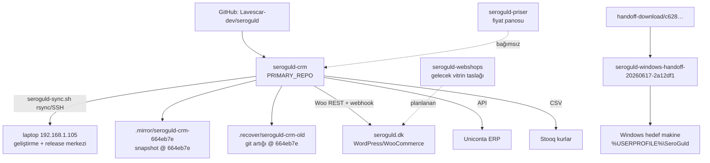

# ARCHITECTURE — Sero Guld CRM

> **Son doğrulama:** 2026-08-09 · **Repo:** `seroguld-crm` · **Branch:** `build/seroguld-feedback-20260610-140000` · **Doğrulama seviyesi:** VERIFIED

## 1. Repo topolojisi



**Multi-repo notu:** Sistem tek Git reposunda monorepo'dur; `seroguld-priser` ve `seroguld-webshops` Git'siz ayrı projelerdir (kendi build/deploy yaşamları var). Her repo SHA'sı ayrı tutulur; bu denetimde yalnız `seroguld-crm` kanoniktir.

| Kopya | HEAD | Rol |
|---|---|---|
| `seroguld-crm` | `build/seroguld-feedback-20260610-140000` | Kanonik çalışma kopyası |
| `.mirror/seroguld-crm-664eb7e` | `664eb7e8981f40a8bade454e0797ea22259d4ec6` | Mirror snapshot (12 kirli dosya) |
| `.recover/seroguld-crm-old` | `664eb7e8981f40a8bade454e0797ea22259d4ec6` | Kurtarma artığı (437 silik dosya) |

## 2. Bileşenler

```mermaid
graph LR
    subgraph Tauri Desktop (tek process shell)
        MW[main window<br/>operatör UI]
        CD[customer-display window<br/>/display/:token]
        DP[document-preview window]
    end
    subgraph Frontend Vite+React src-v2
        MW
        CD
    end
    subgraph Backend FastAPI :8100
        API[/api/v2/* routers/]
        SVC[services/]
        DB[(SQLite desktop.db /<br/>PostgreSQL prod)]
        FS[(data/documents,<br/>media, logs, backups)]
    end
    MW -->|REST Bearer JWT| API
    CD -->|REST+WS auth'suz token| API
    API --> SVC --> DB
    SVC --> FS
    SVC -->|Woo REST| WOO[seroguld.dk]
    WOO -->|webhook HMAC| API
    SVC -->|API key| UNI[Uniconta]
    SVC -->|CSV 20sn cache| STQ[Stooq]
    SVC -->|WOPI| OO[OnlyOffice]
```

- **Backend:** `backend/app/` — `api/` (auth, v2_alis, v2_inventory, v2_log, v2_woocommerce, uniconta, gdpr, webhooks, products, customers, reports…), `services/` (pos_purchase_finalize, pos_service, uniconta_service, woocommerce, afg melt lot, document_artifact_*, gold_price, antifraud_helpers, gdpr_service…), `models/` (ORM), `schemas/`, `utils/`. FastAPI 0.115 + async SQLAlchemy 2.0 + Alembic (head `0023_pos_document_customer_snapshot`).
- **Frontend:** `frontend/src-v2/` — `app.tsx` (createHashRouter), `make/<modül>/` (hook + saf render), `lib/` (api.ts, auth.ts, desktop.ts, artifactSync.ts), `types.ts` (~95 tip). `legacy-next/` DEPRECATED.
- **Desktop:** `desktop/src-tauri/src/main.rs` (585 satır, 9 invoke handler; pencere/monitör yönetimi, Linux-gated zenity/xdg-open, rfd fallback). `desktop/scripts/dev.js` dev orchestrator. Bundle: yalnız NSIS.
- **Veri:** SQLite `data/desktop.db` (dev, VERIFIED aktif); `data/seroguld_crm.db` 0 bayt artık dosya. Prod hedef Postgres (docker-compose).

## 3. Ana veri akışları

1. **AFG alım:** UI → `POST /api/v2/alis/workspace` (PosSession DRAFT) → satırlar → müşteri → `POST …/finalize` → `finalize_purchase_workspace` (satır kilidi, 409 guard) → PosDocument(purchase_receipt=AFG) + Transaction + TransactionLine → Uniconta hybrid sync → Log workspace'te `awaiting_decision`.
2. **Route kararı:** Log'da `destination ∈ {inventory, undecided, melt}` → inventory/undecided: `create_product_service` → `products` (Depolama); melt: Product MELTED + açık draft melt lot'a auto-attach.
3. **Müşteri ekranı:** PosSession.display_token → Tauri `ensure_customer_display_window(route)` → `/display/:token` → REST ilk yükleme + WS `/api/v2/display/:token/ws` canlı snapshot (maskeli kişisel veri).
4. **Woo satışı:** Woo sipariş → webhook (HMAC-SHA256) → `_apply_sale_items` → CRM satış kaydı (FOR_SALE→SOLD).
5. **Excel dock:** `document_artifacts` (sha256 checksum) ↔ OnlyOffice WOPI ↔ reconcile-preview/apply → workspace satırları.

## 4. Runtime sınırları

- **Tek worker zorunlu** (`uvicorn --workers 1`): Uniconta/OPMC/DebtorClient cache process-singleton. (AGENTS.md, VERIFIED)
- **Tek operatör varsayımı:** aynı anda çoklu operatör için tasarlanmamış; müşteri başına açık taslak 409 ile korunur ama genel eşzamanlılık stratejisi sınırlı (INFERRED).
- **Desktop-first:** docker-compose web stack "secondary" olarak işaretli (compose satır 1 yorumu).
- **Backend adresi build-time gömülü:** `VITE_API_BASE_URL` (Windows release default `http://192.168.1.105:8100`); runtime override yok (INFERRED risk).

## 5. Masaüstü / web / WordPress ilişkisi

- Masaüstü (Tauri) kanonik dağıtım biçimi; web (nginx+compose) ikincil.
- WordPress (seroguld.dk) harici sistem; CRM → WP: ürün publish + GDPR köprü config; WP → CRM: webhook siparişleri. Ayrı WP repo'su YOK. Detay: [WORDPRESS_INTEGRATION.md](WORDPRESS_INTEGRATION.md).

## 6. Platform mimarisi (özet)

Platform-bağımsız çekirdek: FastAPI backend + React UI (iş kuralları OS'ten bağımsız). Platform adaptörleri: Tauri Rust shell (pencere/monitör/diyalog; Linux-only kod `cfg(target_os="linux")` ile izole), `desktop/scripts/dev.js` (POSIX-only, Windows'ta handoff `.ps1` zinciri kullanılır). Detay ve öneriler: [PLATFORM_COMPATIBILITY.md](PLATFORM_COMPATIBILITY.md).
